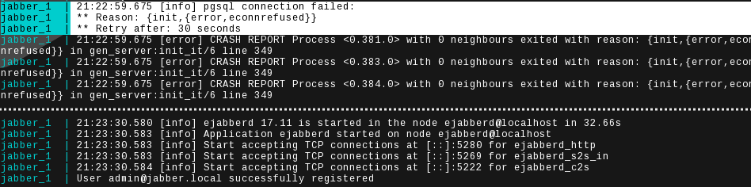

This repository is dedicated to demonstrate the configuration of an ejabberd
server in combination with an PostgreSQL backend. It is based on the great
[hausgold/ejabberd Docker image](https://hub.docker.com/r/hausgold/ejabberd/)
to keep it small. Just boot it up and play with it. All the details are
attached to this readme file.

- [Requirements](#requirements)
- [Getting started](#getting-started)
- [Pidgin Test](#pidgin-test)
- [Caveats](#caveats)
- [Configuration](#configuration)
- [mDNS host configuration](#mdns-host-configuration)
- [Further reading](#further-reading)

## Requirements

* [GNU Make](https://www.gnu.org/software/make/) (>=4.2.1)
* [Docker](https://www.docker.com/get-docker) (>=17.06.0-ce)
* [Docker Compose](https://docs.docker.com/compose/install/) (>=1.15.0)
* [pgAdmin](https://www.pgadmin.org/) - optional
* [Pidgin](https://pidgin.im/) - optional

## Getting started

First you need to clone this repository from Github:

```bash
# Clone the repository
$ git clone https://github.com/Jack12816/ejabberd-postgresql-prototype.git
# Go in the repository directory
$ cd ejabberd-postgresql-prototype
```

We assume you have prepared the requirements in advance. The only thing
which is left, is to start the application:

```bash
$ make start
```

## Pidgin Test

Just start Pidgin and create a new account and choose the following settings:

* Protocol: XMPP
* User: admin
* Domain: jabber.local
* Password: defaultpw

Afterwards accept the certificate request and then you should be able to send
messages and create chat rooms. On the database side you can control the tables
with pgAdmin (see the [docker-compose file](./docker-compose.yml) for the
credentials, the hostname is `db.local`).


## Caveats

For PostgreSQL you need to supply and migrate the schema yourself. Use the
[sql/pg.sql
file](https://github.com/processone/ejabberd/blob/master/sql/pg.sql), not the
[sql/pg.new.sql
file](https://github.com/processone/ejabberd/blob/master/sql/pg.new.sql).
Except you have a ejabberd version [which was compiled
with](https://github.com/processone/ejabberd/issues/2183#issuecomment-354101801)
`--enable-new-sql-schema`.

The good news for elastic Docker (Compose) setups is: when ejabberd fails to
connect to the PostgreSQL database due to startup/migration reasons, it retries
the connection 30 seconds later.



## Configuration

```diff
--- ejabberd.yml.orig	2018-01-20 21:00:50.000000000 +0100
+++ ejabberd.yml	2018-01-20 23:42:15.845922193 +0100
@@ -81,7 +81,7 @@
 ##   - "example.org"
 ##
 hosts:
-  - "{[MDNS_HOSTNAME]}"
+  - "jabber.local"

 ##
 ## route_subdomains: Delegate subdomains to other XMPP servers.
@@ -257,7 +257,13 @@
 ## If you want to use a different method,
 ## comment this line and enable the correct ones.
 ##
-auth_method: internal
+#
+# If you decide to store user password in ejabberd, you need to tell ejabberd
+# to use MySQL instead of internal database for authentication.  You thus need
+# to change ejabberd configuration auth_method to replace internal
+# authentication with sql:
+auth_method:
+  - sql

 ##
 ## Store the plain passwords or hashed for SCRAM:
@@ -348,6 +354,10 @@
 ## you want to use other database backends.
 ## Please consult the ejabberd Guide for details on database creation.

+# However, if you want to use MySQL for all modules that support MySQL as
+# db_type, you can simply use global option default_db: sql:
+default_db: sql
+
 ##
 ## MySQL server:
 ##
@@ -363,11 +373,11 @@
 ##
 ## PostgreSQL server:
 ##
-## sql_type: pgsql
-## sql_server: "server"
-## sql_database: "database"
-## sql_username: "username"
-## sql_password: "password"
+sql_type: pgsql
+sql_server: "db"
+sql_database: "ejabberd"
+sql_username: "postgres"
+sql_password: "postgres"
 ##
 ## If you want to specify the port:
 ## sql_port: 1234
@@ -429,7 +439,7 @@
   ##
   admin:
      user:
-       - "admin@{[MDNS_HOSTNAME]}"
+       - "admin@jabber.local"

   ##
   ## Blocked users
@@ -669,10 +679,10 @@
   ## limited to 2GB which might be exceeded on large servers
   ## mod_mam: {} # for xep0313, mnesia is limited to 2GB, better use an SQL backend
   mod_mam:
-    request_activates_archiving: true
+    request_activates_archiving: false
     iqdisc: one_queue
     default: always
-    db_type: mnesia
+    db_type: sql
   mod_muc:
     ## host: "conference.@HOST@"
     access:
```

## mDNS host configuration

If you running Ubuntu, everything should be in place out of the box. When
you however find yourself unable to resolve the domains, read on.

**Heads up:** This is the Arch Linux way. (package and service names may
differ, config is the same) Install the `nss-mdns` and `avahi` packages, enable
and start the `avahi-daemon.service`. Then, edit the file /etc/nsswitch.conf
and change the hosts line like this:

```bash
hosts: ... mdns4_minimal [NOTFOUND=return] resolve [!UNAVAIL=return] dns ...
```

**Further readings**

* Archlinux howto: https://wiki.archlinux.org/index.php/avahi
* Ubuntu/Debian howto: https://wiki.ubuntuusers.de/Avahi/

## Further reading

* https://packages.ubuntu.com/bionic/ejabberd (suggestions)
* https://docs.ejabberd.im/admin/databases/mysql/
* https://docs.ejabberd.im/developer/sql-schema/
* https://hub.docker.com/_/postgres/
